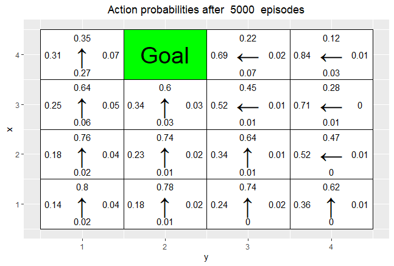
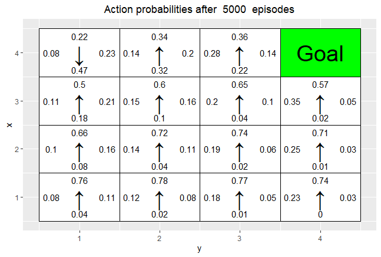
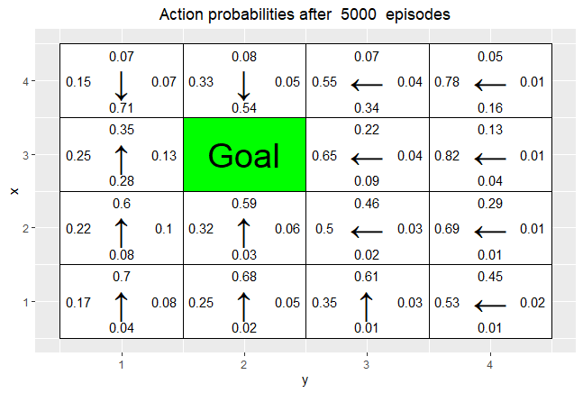
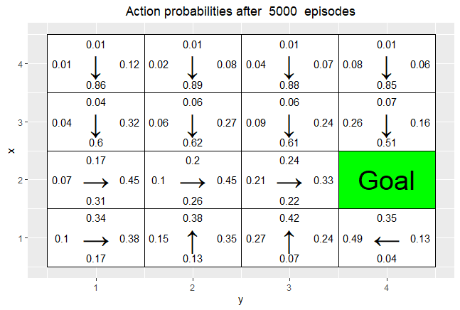
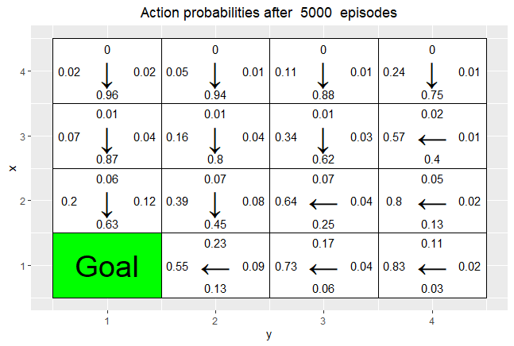
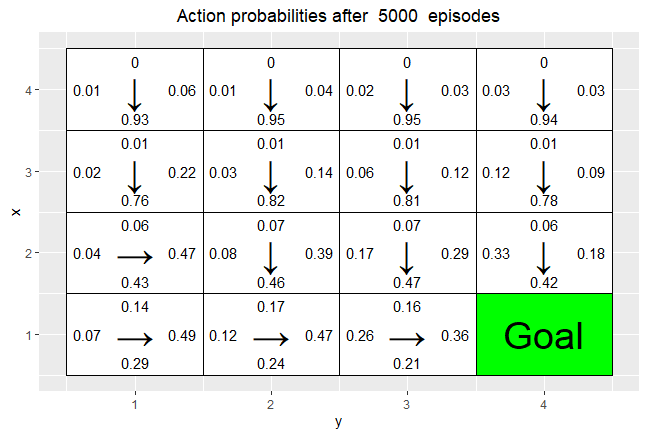
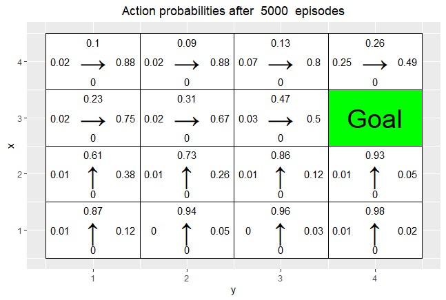
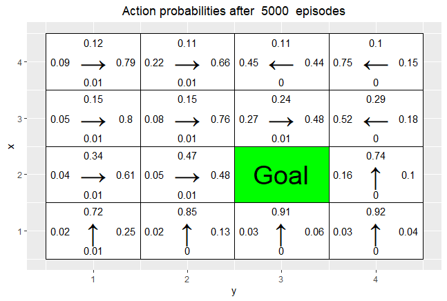

```{r setup, include=FALSE}
knitr::opts_chunk$set(echo = TRUE, message = FALSE, warning = FALSE, out.width='.49\\linewidth', fig.width=5, fig.height=5,fig.show='hold',fig.align='center', results='asis')
```

```{r}
# By Jose M. Peña and Joel Oskarsson.
# For teaching purposes.
# jose.m.pena@liu.se.

#####################################################################################################
# Q-learning
#####################################################################################################

# install.packages("ggplot2")
# install.packages("vctrs")
library(ggplot2)

# If you do not see four arrows in line 16, then do the following:
# File/Reopen with Encoding/UTF-8

arrows <- c("^", ">", "v", "<")
action_deltas <- list(c(1,0), # up
                      c(0,1), # right
                      c(-1,0), # down
                      c(0,-1)) # left

vis_environment <- function(iterations=0, epsilon = 0.5, alpha = 0.1, gamma = 0.95, beta = 0){
  
  # Visualize an environment with rewards. 
  # Q-values for all actions are displayed on the edges of each tile.
  # The (greedy) policy for each state is also displayed.
  # 
  # Args:
  #   iterations, epsilon, alpha, gamma, beta (optional): for the figure title.
  #   reward_map (global variable): a HxW array containing the reward given at each state.
  #   q_table (global variable): a HxWx4 array containing Q-values for each state-action pair.
  #   H, W (global variables): environment dimensions.
  
  df <- expand.grid(x=1:H,y=1:W)
  foo <- mapply(function(x,y) ifelse(reward_map[x,y] == 0,q_table[x,y,1],NA),df$x,df$y)
  df$val1 <- as.vector(round(foo, 2))
  foo <- mapply(function(x,y) ifelse(reward_map[x,y] == 0,q_table[x,y,2],NA),df$x,df$y)
  df$val2 <- as.vector(round(foo, 2))
  foo <- mapply(function(x,y) ifelse(reward_map[x,y] == 0,q_table[x,y,3],NA),df$x,df$y)
  df$val3 <- as.vector(round(foo, 2))
  foo <- mapply(function(x,y) ifelse(reward_map[x,y] == 0,q_table[x,y,4],NA),df$x,df$y)
  df$val4 <- as.vector(round(foo, 2))
  foo <- mapply(function(x,y) 
    ifelse(reward_map[x,y] == 0,arrows[GreedyPolicy(x,y)],reward_map[x,y]),df$x,df$y)
  df$val5 <- as.vector(foo)
  foo <- mapply(function(x,y) ifelse(reward_map[x,y] == 0,max(q_table[x,y,]),
                                     ifelse(reward_map[x,y]<0,NA,reward_map[x,y])),df$x,df$y)
  df$val6 <- as.vector(foo)
  
  print(ggplot(df,aes(x = y,y = x)) +
          scale_fill_gradient(low = "white", high = "green", na.value = "red", name = "") +
          geom_tile(aes(fill=val6)) +
          geom_text(aes(label = val1),size = 2,nudge_y = .35,na.rm = TRUE) +
          geom_text(aes(label = val2),size = 2,nudge_x = .35,na.rm = TRUE) +
          geom_text(aes(label = val3),size = 2,nudge_y = -.35,na.rm = TRUE) +
          geom_text(aes(label = val4),size = 2,nudge_x = -.35,na.rm = TRUE) +
          geom_text(aes(label = val5),size = 5) +
          geom_tile(fill = 'transparent', colour = 'black') + 
          ggtitle(paste("Q-table after ",iterations," iterations\n",
                        "(epsilon = ",epsilon,", alpha = ",alpha,"gamma = ",gamma,", beta = ",beta,")")) +
          theme(plot.title = element_text(hjust = 0.5)) +
          scale_x_continuous(breaks = c(1:W),labels = c(1:W)) +
          scale_y_continuous(breaks = c(1:H),labels = c(1:H)))
  
}

GreedyPolicy <- function(x, y){
  
  # Get a greedy action for state (x,y) from q_table.
  #
  # Args:
  #   x, y: state coordinates.
  #   q_table (global variable): a HxWx4 array containing Q-values for each state-action pair.
  # 
  # Returns:
  #   An action, i.e. integer in {1,2,3,4}.
  
  # Your code here.
  return(which.max(rank(q_table[x,y,], ties.method = "random")))
}

EpsilonGreedyPolicy <- function(x, y, epsilon){
  
  # Get an epsilon-greedy action for state (x,y) from q_table.
  #
  # Args:
  #   x, y: state coordinates.
  #   epsilon: probability of acting randomly.
  # 
  # Returns:
  #   An action, i.e. integer in {1,2,3,4}.
  
  # Your code here.
  if(runif(1)>epsilon){
    direction = GreedyPolicy(x,y)
  }else{
    direction = sample(1:4,1)
  }
  
  return(direction)
}

transition_model <- function(x, y, action, beta){
  
  # Computes the new state after given action is taken. The agent will follow the action 
  # with probability (1-beta) and slip to the right or left with probability beta/2 each.
  # 
  # Args:
  #   x, y: state coordinates.
  #   action: which action the agent takes (in {1,2,3,4}).
  #   beta: probability of the agent slipping to the side when trying to move.
  #   H, W (global variables): environment dimensions.
  # 
  # Returns:
  #   The new state after the action has been taken.
  
  delta <- sample(-1:1, size = 1, prob = c(0.5*beta,1-beta,0.5*beta))
  final_action <- ((action + delta + 3) %% 4) + 1
  foo <- c(x,y) + unlist(action_deltas[final_action])
  foo <- pmax(c(1,1),pmin(foo,c(H,W)))
  
  return (foo)
}

q_learning <- function(start_state, epsilon = 0.5, alpha = 0.1, gamma = 0.95, 
                       beta = 0){
  
  # Perform one episode of Q-learning. The agent should move around in the 
  # environment using the given transition model and update the Q-table.
  # The episode ends when the agent reaches a terminal state.
  # 
  # Args:
  #   start_state: array with two entries, describing the starting position of the agent.
  #   epsilon (optional): probability of acting greedily.
  #   alpha (optional): learning rate.
  #   gamma (optional): discount factor.
  #   beta (optional): slipping factor.
  #   reward_map (global variable): a HxW array containing the reward given at each state.
  #   q_table (global variable): a HxWx4 array containing Q-values for each state-action pair.
  # 
  # Returns:
  #   reward: reward received in the episode.
  #   correction: sum of the temporal difference correction terms over the episode.
  #   q_table (global variable): Recall that R passes arguments by value. So, q_table being
  #   a global variable can be modified with the superassigment operator <<-.
  
  # Your code here.
  current_state = start_state
  episode_correction = 0
  repeat{
    # Follow policy, execute action, get reward.
    action = EpsilonGreedyPolicy(current_state[1], current_state[2], epsilon)
    new_state = transition_model(current_state[1], current_state[2], action, beta)
    reward = reward_map[new_state[1], new_state[2]]
    
    # Q-table update.
    q_action_value = q_table[current_state[1], current_state[2], action]
    next_exp_r = max(q_table[new_state[1], new_state[2],])
    
    correction = reward + gamma*next_exp_r - q_action_value
    q_table[current_state[1], current_state[2],action] <<- q_action_value + alpha*(correction)
    episode_correction = episode_correction+correction
    current_state=new_state
    if(reward!=0)
      # End episode.
      return (c(reward,episode_correction))
    
  }
  
}

#####################################################################################################
# Q-Learning Environments
#####################################################################################################

# Environment A (learning)

H <- 5
W <- 7

reward_map <- matrix(0, nrow = H, ncol = W)
reward_map[3,6] <- 10
reward_map[2:4,3] <- -1

q_table <- array(0,dim = c(H,W,4))

#vis_environment()

for(i in 1:10000){
  foo <- q_learning(start_state = c(3,1))
  
  if(any(i==c(10,100,1000,10000)))
    vis_environment(i)
}

```
\textbf{After 10 episodes:}
The agent visited the states with -1 and started to update those action values. 

\textbf{Is the greedy policy optimal after 10000 episodes:}
A policy is optimal if it maximizes the expected discounted return, no matter what Q-values it was derived from. The greedy policy is optimal after 10000 episodes, because we decide on the best action in every given case.

\textbf{Does the agent learn that there are multiple paths to get to the positive reward ?
If not, what could be done to make the agent learn this ?}
Yes, the aget does for some states, the q value is equal, but not for all states. To make it learn all equal paths, we could run more episodes and make the robot explore the entire grid more. 

```{r}
# Environment B (the effect of epsilon and gamma)

H <- 7
W <- 8

reward_map <- matrix(0, nrow = H, ncol = W)
reward_map[1,] <- -1
reward_map[7,] <- -1
reward_map[4,5] <- 5
reward_map[4,8] <- 10

q_table <- array(0,dim = c(H,W,4))

#vis_environment()
```

\newpage
```{r}
MovingAverage <- function(x, n){
  
  cx <- c(0,cumsum(x))
  rsum <- (cx[(n+1):length(cx)] - cx[1:(length(cx) - n)]) / n
  
  return (rsum)
}

# Epsilon 0.5
for(j in c(0.5,0.75,0.95)){
  q_table <- array(0,dim = c(H,W,4))
  reward <- NULL
  correction <- NULL
  
  for(i in 1:30000){
    foo <- q_learning(gamma = j, start_state = c(4,1))
    reward <- c(reward,foo[1])
    correction <- c(correction,foo[2])
  }
  
  vis_environment(i, gamma = j)
  plot(MovingAverage(reward,100),type = "l")
  plot(MovingAverage(correction,100),type = "l")
}
```


```{r}
# Epsilon 0.1
for(j in c(0.5,0.75,0.95)){
  q_table <- array(0,dim = c(H,W,4))
  reward <- NULL
  correction <- NULL
  
  for(i in 1:30000){
    foo <- q_learning(epsilon = 0.1, gamma = j, start_state = c(4,1))
    reward <- c(reward,foo[1])
    correction <- c(correction,foo[2])
  }
  
  vis_environment(i, epsilon = 0.1, gamma = j)
  plot(MovingAverage(reward,100),type = "l")
  plot(MovingAverage(correction,100),type = "l")
}
```
\textbf{Effect of gamma and epsilon:}
Gamma impact our discounted reward. A lower value of gamma would mean that we prefere a reward earlier. Therfore for low gamma we prefer the reward of 5, because it requires fewer steps. And with a walue closer to 1 we prefere the reward of 10, because we do not care about the extra steps required.

Epsilon is the probability to explore a random step. When we have a low value our agent do not explore and therfore it does not find the reward of 10.

```{r}
# Environment C (the effect of beta).

H <- 3
W <- 6

reward_map <- matrix(0, nrow = H, ncol = W)
reward_map[1,2:5] <- -1
reward_map[1,6] <- 10

q_table <- array(0,dim = c(H,W,4))

#vis_environment()

for(j in c(0,0.2,0.4,0.66)){
  q_table <- array(0,dim = c(H,W,4))
  
  for(i in 1:10000)
    foo <- q_learning(gamma = 0.6, beta = j, start_state = c(1,1))
  
  vis_environment(i, gamma = 0.6, beta = j)
}
```
\textbf{Effect of beta:}
Beta is the probability to slip. The probability to slip is affecting the Agent after it takes an action. Therfore this probability of slipping is taken into account in when creating the policy, because we update Q(S,A) depending on what action we took and where the agent ended up. We can se that with the higher beta (0.66) the policy decide to walk away from the negative reward to make sure it do not slip into it. And with lower beta (0) the policy take the shortest path and decide to walk right (along the negative rewards).

## Environment D









\textbf{Has the agent learned a good policy? Why / Why not ?}
The agent learned a good policy, it seem to predict a good action for all validation goals. The policy was trained on a lot of different goals, which is good. If the traing goals are to different from the validation goals. Then the policy would not learn a good policy for those unseen goals. 
\textbf{Could you have used the Q-learning algorithm to solve this task ?}
No because the goal changes its position and Q-learning has the same q, not depending on the goal. (The agent does not know where the goal is.)


## Environment E



\textbf{Has the agent learned a good policy? Why / Why not ?
If the results obtained for environments D and E differ, explain why}
In Environment E, we only train on goals in row 4 (X-value). Therfore the training goals is to different from the validation goals. The policy will never learn to take an action that points down. Because the probability of performing the action "down", will aproach zero, becase that was never "observed" in training (With high weight).

```{r, eval=FALSE}
# By Jose M. Peña and Joel Oskarsson.
# For teaching purposes.
# jose.m.pena@liu.se.

#####################################################################################################
# REINFORCE
#####################################################################################################

# install.packages("keras")

library(tensorflow)
install_tensorflow()
library(keras)


# install.packages("ggplot2")
# install.packages("vctrs")
library(ggplot2)

# If you do not see four arrows in line 19, then do the following:
# File/Reopen with Encoding/UTF-8

arrows <- c("↑", "→", "↓", "←")
action_deltas <- list(c(1,0), # up
                      c(0,1), # right
                      c(-1,0), # down
                      c(0,-1)) # left

vis_prob <- function(goal, episodes = 0){
  
  # Visualize an environment with rewards. 
  # Probabilities for all actions are displayed on the edges of each tile.
  # The (greedy) policy for each state is also displayed.
  # 
  # Args:
  #   goal: goal coordinates, array with 2 entries.
  #   episodes, epsilon, alpha, gamma, beta (optional): for the figure title.
  #   H, W (global variables): environment dimensions.
  
  df <- expand.grid(x=1:H,y=1:W)
  dist <- array(data = NA, dim = c(H,W,4))
  class <- array(data = NA, dim = c(H,W))
  for(i in 1:H)
    for(j in 1:W){
      dist[i,j,] <- DeepPolicy_dist(i,j,goal[1],goal[2])
      foo <- which(dist[i,j,]==max(dist[i,j,]))
      class[i,j] <- ifelse(length(foo)>1,sample(foo, size = 1),foo)
    }
  
  foo <- mapply(function(x,y) ifelse(all(c(x,y) == goal),NA,dist[x,y,1]),df$x,df$y)
  df$val1 <- as.vector(round(foo, 2))
  foo <- mapply(function(x,y) ifelse(all(c(x,y) == goal),NA,dist[x,y,2]),df$x,df$y)
  df$val2 <- as.vector(round(foo, 2))
  foo <- mapply(function(x,y) ifelse(all(c(x,y) == goal),NA,dist[x,y,3]),df$x,df$y)
  df$val3 <- as.vector(round(foo, 2))
  foo <- mapply(function(x,y) ifelse(all(c(x,y) == goal),NA,dist[x,y,4]),df$x,df$y)
  df$val4 <- as.vector(round(foo, 2))
  foo <- mapply(function(x,y) ifelse(all(c(x,y) == goal),NA,class[x,y]),df$x,df$y)
  df$val5 <- as.vector(arrows[foo])
  foo <- mapply(function(x,y) ifelse(all(c(x,y) == goal),"Goal",NA),df$x,df$y)
  df$val6 <- as.vector(foo)
  
  print(ggplot(df,aes(x = y,y = x)) +
          geom_tile(fill = 'white', colour = 'black') +
          scale_fill_manual(values = c('green')) +
          geom_tile(aes(fill=val6), show.legend = FALSE, colour = 'black') +
          geom_text(aes(label = val1),size = 4,nudge_y = .35,na.rm = TRUE) +
          geom_text(aes(label = val2),size = 4,nudge_x = .35,na.rm = TRUE) +
          geom_text(aes(label = val3),size = 4,nudge_y = -.35,na.rm = TRUE) +
          geom_text(aes(label = val4),size = 4,nudge_x = -.35,na.rm = TRUE) +
          geom_text(aes(label = val5),size = 10,na.rm = TRUE) +
          geom_text(aes(label = val6),size = 10,na.rm = TRUE) +
          ggtitle(paste("Action probabilities after ",episodes," episodes")) +
          theme(plot.title = element_text(hjust = 0.5)) +
          scale_x_continuous(breaks = c(1:W),labels = c(1:W)) +
          scale_y_continuous(breaks = c(1:H),labels = c(1:H)))
  
}

transition_model <- function(x, y, action, beta){
  
  # Computes the new state after given action is taken. The agent will follow the action 
  # with probability (1-beta) and slip to the right or left with probability beta/2 each.
  # 
  # Args:
  #   x, y: state coordinates.
  #   action: which action the agent takes (in {1,2,3,4}).
  #   beta: probability of the agent slipping to the side when trying to move.
  #   H, W (global variables): environment dimensions.
  # 
  # Returns:
  #   The new state after the action has been taken.
  
  delta <- sample(-1:1, size = 1, prob = c(0.5*beta,1-beta,0.5*beta))
  final_action <- ((action + delta + 3) %% 4) + 1
  foo <- c(x,y) + unlist(action_deltas[final_action])
  foo <- pmax(c(1,1),pmin(foo,c(H,W)))
  
  return (foo)
}

DeepPolicy_dist <- function(x, y, goal_x, goal_y){
  
  # Get distribution over actions for state (x,y) and goal (goal_x,goal_y) from the deep policy.
  #
  # Args:
  #   x, y: state coordinates.
  #   goal_x, goal_y: goal coordinates.
  #   model (global variable): NN encoding the policy.
  # 
  # Returns:
  #   A distribution over actions.
  
  foo <- matrix(data = c(x,y,goal_x,goal_y), nrow = 1)
  
  # return (predict_proba(model, x = foo))
  return (predict_on_batch(model, x = foo)) # Faster.
  
}

DeepPolicy <- function(x, y, goal_x, goal_y){
  
  # Get an action for state (x,y) and goal (goal_x,goal_y) from the deep policy.
  #
  # Args:
  #   x, y: state coordinates.
  #   goal_x, goal_y: goal coordinates.
  #   model (global variable): NN encoding the policy.
  # 
  # Returns:
  #   An action, i.e. integer in {1,2,3,4}.
  
  foo <- DeepPolicy_dist(x,y,goal_x,goal_y)
  
  return (sample(1:4, size = 1, prob = foo))
  
}

DeepPolicy_train <- function(states, actions, goal, gamma){
  
  # Train the policy network on a rolled out trajectory.
  # 
  # Args:
  #   states: array of states visited throughout the trajectory.
  #   actions: array of actions taken throughout the trajectory.
  #   goal: goal coordinates, array with 2 entries.
  #   gamma: discount factor.
  
  # Construct batch for training.
  inputs <- matrix(data = states, ncol = 2, byrow = TRUE)
  inputs <- cbind(inputs,rep(goal[1],nrow(inputs)))
  inputs <- cbind(inputs,rep(goal[2],nrow(inputs)))
  # Store States in col 1 & 2 (x and y) and then store goal for each row in col 3 and 4(x and y).
  
  targets <- array(data = actions, dim = nrow(inputs))
  targets <- to_categorical(targets-1, num_classes = 4)  
  
  # Sample weights. Reward of 5 for reaching the goal.
  weights <- array(data = 5*(gamma^(nrow(inputs)-1)), dim = nrow(inputs))
  
  # Train on batch. Note that this runs a SINGLE gradient update.
  train_on_batch(model, x = inputs, y = targets, sample_weight = weights)
  
}

reinforce_episode <- function(goal, gamma = 0.95, beta = 0){
  
  # Rolls out a trajectory in the environment until the goal is reached.
  # Then trains the policy using the collected states, actions and rewards.
  # 
  # Args:
  #   goal: goal coordinates, array with 2 entries.
  #   gamma (optional): discount factor.
  #   beta (optional): probability of slipping in the transition model.
  
  # Randomize starting position.
  cur_pos <- goal
  while(all(cur_pos == goal))
    cur_pos <- c(sample(1:H, size = 1),sample(1:W, size = 1))
  
  states <- NULL
  actions <- NULL
  
  steps <- 0 # To avoid getting stuck and/or training on unnecessarily long episodes.
  while(steps < 20){
    steps <- steps+1
    
    # Follow policy and execute action.
    action <- DeepPolicy(cur_pos[1], cur_pos[2], goal[1], goal[2])
    new_pos <- transition_model(cur_pos[1], cur_pos[2], action, beta)
    
    # Store states and actions.
    states <- c(states,cur_pos)
    actions <- c(actions,action)
    cur_pos <- new_pos
    
    if(all(new_pos == goal)){
      # Train network.
      DeepPolicy_train(states,actions,goal,gamma)
      break
    }
  }
  
}

#####################################################################################################
# REINFORCE Environments
#####################################################################################################

# Environment D (training with random goal positions)

H <- 4
W <- 4

# Define the neural network (two hidden layers of 32 units each).
model <- keras_model_sequential()
model %>% 
  layer_dense(units = 32, input_shape = c(4), activation = 'relu') %>% 
  layer_dense(units = 32, activation = 'relu') %>% 
  layer_dense(units = 4, activation = 'softmax')

compile(model, loss = "categorical_crossentropy", optimizer = optimizer_sgd(lr=0.001))

initial_weights <- get_weights(model)

train_goals <- list(c(4,1), c(4,3), c(3,1), c(3,4), c(2,1), c(2,2), c(1,2), c(1,3))
val_goals <- list(c(4,2), c(4,4), c(3,2), c(3,3), c(2,3), c(2,4), c(1,1), c(1,4))

show_validation <- function(episodes){
  
  for(goal in val_goals)
    vis_prob(goal, episodes)
  
}

set_weights(model,initial_weights)

show_validation(0)

for(i in 1:5000){
  if(i%%10==0) cat("episode",i,"\n")
  goal <- sample(train_goals, size = 1)
  reinforce_episode(unlist(goal))
}

show_validation(5000) 
# Environment E (training with top row goal positions)

train_goals <- list(c(4,1), c(4,2), c(4,3), c(4,4))
val_goals <- list(c(3,4), c(2,3), c(1,1))

set_weights(model,initial_weights)

show_validation(0)

for(i in 1:5000){
  if(i%%10==0) cat("episode", i,"\n")
  goal <- sample(train_goals, size = 1)
  reinforce_episode(unlist(goal))
}

show_validation(5000) 
```

